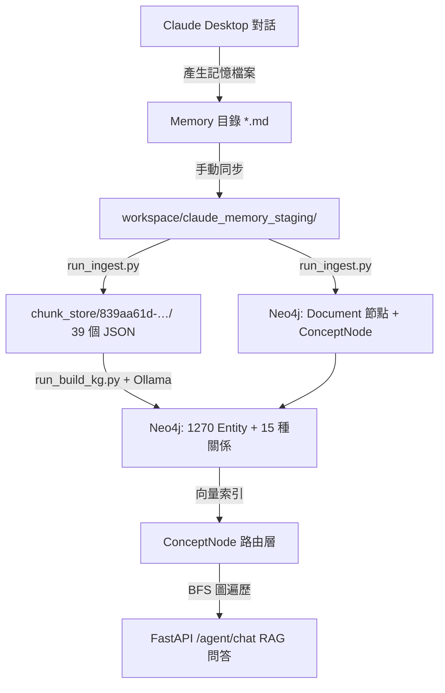

# Claude 對話記憶 (Memory) 導入智慧知識庫與知識圖譜建構任務書

本任務書旨在規劃將 `claude-desktop` 的對話記憶（一堆 Markdown 檔案）同步導入至「智慧知識庫」專案，利用 SVO（主詞-動詞-受詞）三元組技術將其轉化為結構化的知識圖譜（Knowledge Graph），並儲存於 Neo4j 資料庫中，以實現結構化的知識檢索與深度 RAG。

> **最後更新**：2026-06-30

---

## 關鍵參數

| 項目 | 值 |
|------|-----|
| KG ID | `839aa61d-8d97-4e2a-8c74-10fa111c3f38` |
| Neo4j DB 名稱 | `kgclaudeme5cff91a9` |
| Neo4j Browser | `http://localhost:7475` |
| FastAPI 端點 | `http://localhost:8000/agent/chat` |
| Staging 目錄 | `C:\Users\666\Desktop\智慧知識庫\workspace\claude_memory_staging\` |
| Chunk Store | `C:\Users\666\Desktop\智慧知識庫\chunk_store\839aa61d-8d97-4e2a-8c74-10fa111c3f38\` |
| LLM Provider | Ollama（本機，port 11434）|
| Embedding | sentence-transformers/paraphrase-multilingual-MiniLM-L12-v2（CUDA）|

---

## 1. 系統架構與資料流



---

## 2. 任務階段規劃與進度

### 階段一：資料源對接與同步機制 (Data Sync) ✅ 完成

* **目標**：批次將各專案 Memory 檔案同步至智慧知識庫的 ingestion 來源目錄。
* **實際執行**：
  - 來源路徑：`C:\Users\666\.claude\projects\<slug>\memory\`（多個專案）
  - 目標路徑：`workspace\claude_memory_staging\`
* **成果**：**34 個** `.md` 記憶檔案已同步，涵蓋 claude-desktop、RL、world-knowledge-hub 等多個專案的記憶與回饋記錄。

---

### 階段二：文件解析與 Chunk 切分 (Ingestion) ✅ 完成

* **目標**：將記憶文檔切分成 chunk 並持久化，同時在 Neo4j 寫入 Document 節點與 ConceptNode 向量索引。
* **實際執行**（2026-06-29/30 補跑，使用 WSL Ollama `qwen2.5:7b`）：
  ```powershell
  python run_ingest.py ".\workspace\claude_memory_staging" --kg 839aa61d-8d97-4e2a-8c74-10fa111c3f38
  ```
* **成果**（驗證於 Neo4j `neo4j` 預設 DB）：
  - ✅ **72 個** Document 節點，均已透過 CONTAINS 關聯至 claude_memory KG
  - ✅ **590 個** ConceptNode（含 IMPLICIT + EFFECTIVE 邊），384 維向量
  - ✅ 39 個 chunk JSON 檔案保留於 chunk_store
* **架構說明**：Document 節點存於 `neo4j` 預設 DB；SVO Entity 存於 `kgclaudeme5cff91a9` DB

---

### 階段三：SVO 提取與 Neo4j 知識圖譜建構 (Build KG) ✅ 完成

* **目標**：使用 Ollama LLM 提取概念與 SVO 三元組，寫入 Neo4j。
* **實際執行**（2026-06-28 13:45）：
  ```powershell
  python run_build_kg.py --kg 839aa61d-8d97-4e2a-8c74-10fa111c3f38
  ```
* **成果**（在 Neo4j DB `kgclaudeme5cff91a9` 驗證）：

  **Entity 節點：1,270 個，分 10 種類型**

  | 節點類型 | 說明 |
  |---------|------|
  | Entity | 通用實體 |
  | Concept | 概念 |
  | Algorithm | 演算法 |
  | Technology | 技術 |
  | Method | 方法 |
  | Tool | 工具 |
  | Framework | 框架 |
  | Model | 模型 |
  | System | 系統 |
  | Person | 人物 |

  **語意關係（15 種，部分數量）**

  | 關係 | 數量 |
  |------|------|
  | REQUIRES | 65 |
  | CAUSES | 54 |
  | HAS_PROPERTY | 31 |
  | IMPROVES | 27 |
  | DEFINED_AS | 25 |
  | … 其餘 10 種 | … |

---

### 階段四：RAG 整合與知識圖譜應用 (RAG Query) ⚠️ 部分驗證

* **目標**：透過 `POST /agent/chat` 進行帶有圖譜路由與 BFS 遍歷的問答，驗證能從對話記憶中精準召回資訊。
* **驗收測試指令**（已修正使用 kg_id 強制路由）：
  ```powershell
  $body = '{"question":"claude-desktop 的記憶系統架構是什麼？","kg_id":"839aa61d-8d97-4e2a-8c74-10fa111c3f38"}'
  Invoke-RestMethod -Uri "http://localhost:8000/agent/chat" -Method POST -Body $body -ContentType "application/json; charset=utf-8"
  ```
* **目前驗證結果**（2026-06-30）：
  - ✅ KG 路由：`claude_memory` 正確被選中（score: 1.0）
  - ✅ 文件召回：`claude-desktop__memory-system-plan`（score: 0.323）
  - ❌ LLM 生成：`All connection attempts failed`（Ollama 在 WSL 中，Docker 容器無法路由）
* **修改紀錄**（已修改本機原始碼 + `docker cp` 進容器）：
  - `routers/agent.py`：新增 kg_id 強制路由邏輯，`_SIM_MIN_SCORE` 從 0.38 降至 0.28（Ollama 離線時分數系統性偏低）
  - `models/document.py`：`ChatRequest` 新增 `kg_id: UUID | None = None` 欄位
  - ⚠️ 以上修改僅 `docker cp` 進運行中容器，**尚未 rebuild image**
* **待解決：Ollama 連線問題**
  - Ollama 在 WSL `Ubuntu-24.04` 中，以 systemd service 運行（`OLLAMA_HOST=0.0.0.0` override 已設定）
  - WSL IP：`172.18.55.140:11434`（可從 Windows 連通，但 Docker 容器無法直連）
  - **解決方法**（需一次管理員操作）：
    ```cmd
    netsh interface portproxy add v4tov4 listenaddress=0.0.0.0 listenport=11434 connectaddress=172.18.55.140 connectport=11434
    ```
  - 設定後 Docker 容器可透過 `host.docker.internal:11434` 連到 Ollama
  - 設定完成後需 `docker restart kg-api` 重啟服務
* **可選擴充**：為 `claude-desktop` 開發 MCP 伺服器，讓 Claude CLI 透過 Tool 直接查詢記憶圖譜。

---

## 3. 待辦任務清單 (Todo Checklist)

- [x] **建立同步指令與路徑配置**
  - [x] 確定匯入路徑（各專案 `~/.claude/projects/<slug>/memory/`）
  - [x] 於 Neo4j 中初始化 `claude_memory` 知識圖譜實例（DB: `kgclaudeme5cff91a9`）

- [x] **批次執行 Ingestion（chunk 建立）**
  - [x] `chunk_store/839aa61d-…/` 已生成 39 個 chunk JSON

- [x] **#1 補跑 Ingestion（補建 Document + ConceptNode）** ✅ 完成（2026-06-30）
  - [x] 執行：`python run_ingest.py ".\workspace\claude_memory_staging" --kg ...`（成功 39/39，耗時 20.7 min）
  - [x] 驗證：Neo4j `neo4j` DB → 72 個 Document，590 個 ConceptNode（EFFECTIVE 邊）
  - [x] Ollama 路徑：WSL Ubuntu-24.04 `qwen2.5:7b`（172.18.55.140:11434）

- [x] **執行 SVO 圖譜建構**
  - [x] LLM Provider 使用 Ollama（本機）
  - [x] 執行 `run_build_kg.py` 完成
  - [x] 驗證：Entity 節點 1,270 個，15 種語意關係

- [ ] **#2 RAG 完整端到端驗證（需先解決 Ollama 連線）**
  - [x] KG 路由驗證 ✅：`claude_memory` 正確被選中
  - [x] 文件召回驗證 ✅：`claude-desktop__memory-system-plan` 被召回
  - [ ] LLM 生成驗證 ❌：需先執行 `netsh portproxy`（管理員）或以 admin 身份執行一次：
    ```
    netsh interface portproxy add v4tov4 listenaddress=0.0.0.0 listenport=11434 connectaddress=172.18.55.140 connectport=11434
    ```
  - [ ] portproxy 設定後：`docker restart kg-api`，再重跑驗收測試
  - [ ] 同時需要 rebuild image 讓程式碼修改永久生效：
    ```powershell
    cd "C:\Users\666\Desktop\智慧知識庫"
    docker-compose build api && docker-compose up -d api
    ```
